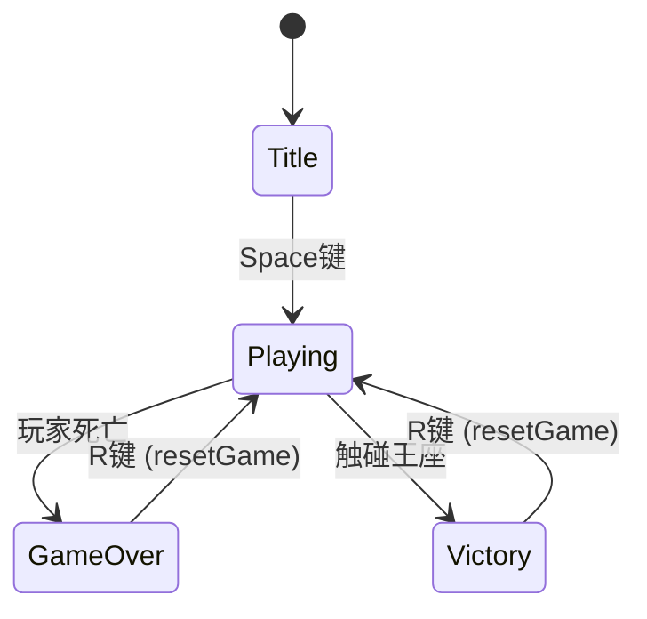
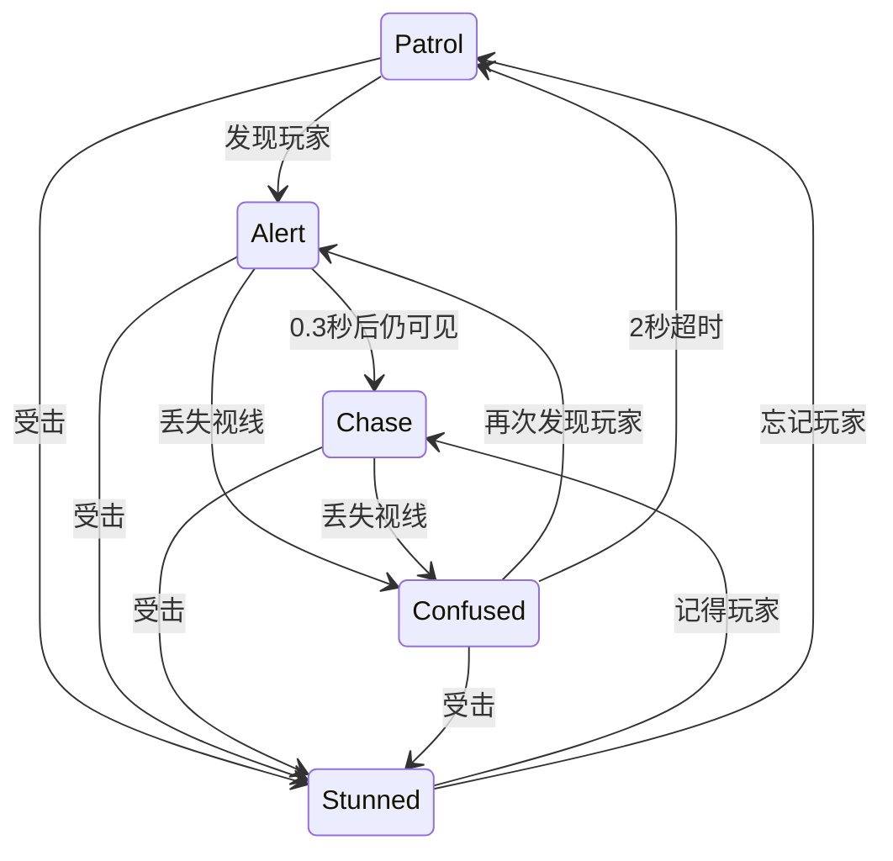
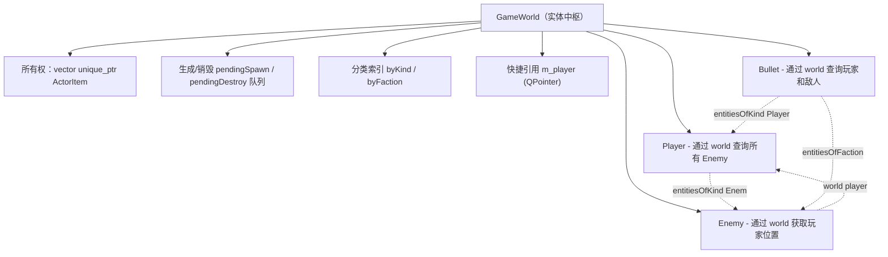
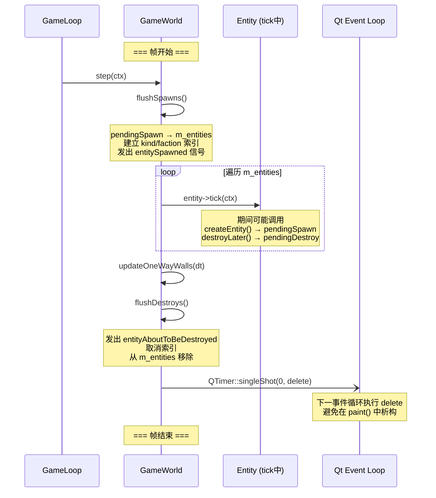

# 高级语言程序设计大作业 - “圆哈镇3022(Quahag)”游戏实验报告

## 一. 作业题目

**基本要求：** 学生自选题目，使用C++语言完成一个图形化的小程序。
* 图形化平台不限，可以是MFC、QT等任何C++图形化平台。
* 程序内容主题不限，可以是小游戏、小工具等。

**自选题目：桌面端“平台跳跃/动作”类游戏——“圆哈镇3022”**

**具体描述：**
本项目基于C++语言和Qt图形框架，开发一款名为”圆哈镇2022（Quahag）”的桌面端2D平台跳跃/动作游戏。故事设定在2022年，玩家操控角色”耄耋”踏上返回故乡”圆哈镇”的旅途——穿行于复杂的博古架地形之间，与名为”胖宝宝”的巡逻敌人周旋战斗，最终夺回王座。游戏中散落着多种功能道具：”哈基米特饮”可赋予短暂的全属性加速，”口香糖”能恢复生命值，合理利用这些道具是通关的关键。

## 二. 开发软件与环境

*   **编程语言**: C++ 17
*   **图形库/框架**: Qt 6.10.2
*   **构建系统**: CMake
*   **编译器**: GCC
*   **IDE**: Visual Studio Code
*   **操作系统**: Debian GNU/Linux forky/sid
*   **音频**: PulseAudio (paplay)

## 三. 课题要求

本项目的核心目标是开发一款完整可玩的2D平台跳跃/动作游戏，具体要求如下：

1. **图形化界面**：基于Qt Widgets（QGraphicsView / QGraphicsScene框架）构建图形化游戏窗口，支持键盘输入、实时渲染和HUD叠加显示。

2. **面向对象设计**：所有游戏实体（玩家、敌人、子弹、道具、粒子特效）继承自统一的抽象基类`ActorItem`（继承自`QGraphicsObject`），通过虚函数`tick()`实现多态行为。各层（UI / Graphics / World / Core）明确的职责分离。

3. **实时游戏循环**：实现约60FPS的固定帧率游戏循环，每帧对所有实体进行物理模拟、状态更新和碰撞检测。支持暂停/恢复机制。

4. **完整的游戏状态机**：实现Title（标题）→ Playing（游戏中）→ GameOver（死亡）/ Victory（胜利）的状态流转，各状态下输入处理和渲染行为不同。

5. **物理模拟**：实现重力、加速度、阻尼、跳跃冲量等2D平台游戏物理系统，支持地面检测、连跳（Double Jump）、贴墙滑落（Wall Slide）和贴墙跳（Wall Jump）。

6. **敌人AI**：实现具有视觉感知（视锥 + 射线检测视线）和五状态有限状态机（Patrol / Alert / Chase / Confused / Stunned）的智能敌人，支持巡逻、发现、追逐、射击和受击反馈。

7. **摄像机系统**：实现带阻尼弹簧平滑跟随的2D摄像机，支持抖动（Shake）、缩放脉冲（Zoom Pulse）、边界夹持和视差背景。

8. **碰撞检测**：实现基于AABB的分离X/Y轴碰撞检测与响应，支持单向通行墙体（One-Way Wall）。

9. **道具与特效**：实现多种可拾取道具（加速道具"哈基米"、回血道具"口香糖"、胜利王座）和粒子特效系统（爆炸粒子、灰尘粒子、爪痕特效、拖尾残影）。

10. **音效系统**：通过 Qt 资源系统加载 WAV 音频，使用 PulseAudio `paplay` 进程播放，实现攻击、拾取道具、击败敌人等场景的音效反馈。

11. **资源管理**：通过Qt资源系统（qrc）管理精灵图片、关卡地图和音效文件。

12. **AI工具使用披露**：本项目的开发过程中使用了Claude Code（基于DeepSeek V4）进行代码开发辅助，包括代码生成、调试、重构和文档编写。所有核心架构设计和算法选择由开发者主导，AI工具仅用于加速实现和定位问题。

## 四. 主要流程与功能实现

### 1. 整体流程

游戏采用三状态机（`GameState`枚举）管理整体流程，由`GameView`类统一协调：



| 状态 | 世界状态 | 摄像机 | 输入 | 画面叠加 |
|------|---------|--------|------|---------|
| **Title** | 暂停（实体冻结） | 5x缩放全景 | 仅Space键 | "Quahag圆哈镇" + "space to start" |
| **Playing** | 活跃 | 1x缩放跟随玩家 | 完整操作 | 生命值、哈基米计时器HUD |
| **GameOver** | 冻结（敌人继续模拟） | 停在死亡位置 | 仅R键 | "死掉了" + "r to play again" |
| **Victory** | 暂停 | 冻结 | 仅R键 | 胜利信息 + "r to play again" |

**状态转换逻辑**：
- Title → Playing：Space键调用`GameLoop::setWorldPaused(false)`，摄像机弹簧缩放从5x平滑过渡到1x
- Playing → GameOver：`updateCamera()`中检测到`playerAlive`变为false时触发
- Playing → Victory：玩家触碰王座时，`GameWorld::m_victory`置为true
- GameOver/Victory → Playing：R键调用`resetGame()`

**重置流程（`resetGame()`）**：清除所有实体（`clearAllEntities()`）→ 重建场景（`rebuildScene()`）→ `LevelBuilder::build()`从地图数据重新生成实体 → `flushSpawns()`刷新生成队列 → 摄像机快照至1x缩放 → 取消世界暂停。

### 2. 功能模块实现

#### 2.1 游戏循环与Tick系统（`core/`）

`GameLoop`以16ms间隔（约62.5FPS）的`QTimer`驱动。每帧的`tick()`流程：

1. 通过`QElapsedTimer::restart()`获取实际帧间隔`dt`
2. 构建`TickContext`参数对象，包含dt、重力常量（2000.0）、`GameWorld`指针、`InputState`指针和`WorldEvents`事件收集器
3. 若世界未暂停，调用`m_world->step(ctx)`对所有实体进行物理和逻辑更新
4. 处理`WorldEvents`中收集的相机效果（抖动、缩放脉冲），通过Qt信号发送至`GameView`
5. 发射`stepped(dt)`信号通知`GameView`更新摄像机

`TickContext`作为参数对象（Parameter Object），将每帧所有上下文信息捆绑传递，避免实体直接依赖全局状态。`WorldEvents`作为事件收集器，允许实体在tick期间声明相机效果需求，由GameLoop在tick完成后统一处理，解耦游戏逻辑与渲染层。

#### 2.2 玩家系统（`entities/player.cpp`）

玩家实现三状态机（`PlayerState`枚举）：

| 状态 | 行为 |
|------|------|
| **Grounded（地面）** | 响应左右移动（600px/s）、跳跃（冲量820）、攻击。通过`coyoteTimer`实现0.08秒土狼时间（Coyote Time），允许离开平台边缘后短暂时间内仍可跳跃 |
| **Airborne（空中）** | 支持二段跳（最多2次，冲量800），空中加速度2000（地面3000），空中阻力1000（地面3000） |
| **WallSliding（贴墙滑）** | 贴墙下落速度限制100px/s，支持贴墙跳（冲量820，0.12秒贴墙锁定防重复吸附） |

**关键参数**：重力2000 px/s²，可缓存跳跃（Jump Buffer）0.1秒——在落地前0.1秒内按下跳跃键也会触发跳跃。

**攻击系统**：非状态锁定的并行系统。近战攻击范围50×50px，冷却0.1秒，视觉效果持续0.2秒。每次攻击生成`ClawEffect`——三段贝塞尔曲线爪痕，随机旋转/缩放，0.1秒伸展动画。攻击触发相机抖动（振幅10，持续0.05秒，频率28Hz）。

**碰撞解析**：分离X/Y轴——先水平移动再解析X碰撞（推离），后垂直移动再解析Y碰撞（推离）。Y碰撞中若速度向下则设`onGround = true`。

**伤害系统**：3点生命值。受击生成10个爆炸粒子 + 相机抖动（振幅10，持续0.1秒，频率28Hz）+ 0.1秒白色闪烁精灵。死亡生成50个粒子并销毁自身。

#### 2.3 敌人AI系统（`entities/enemy.cpp`）

敌人实现五状态有限状态机（`EnemyState`枚举）：



| 状态 | 持续/条件 | 行为 |
|------|----------|------|
| **Patrol** | 未发现玩家 | 5秒行走 + 3秒停顿循环（`fmod(age+seed, 8.0) < 5.0`），速度100px/s，边缘/墙壁检测自动折返 |
| **Alert** | 0.3秒 | 静止观察，触发相机缩放脉冲。持续可见→Chase，丢失→Confused |
| **Chase** | 视线持续 | 面向玩家，150px/s追逐，每0.2秒射击子弹（200px/s固定速度，5秒存活） |
| **Confused** | 2秒 | 静止，头部以8 rad/s左右摆动（`sin(age * 8.0)`）。期间再发现玩家→Alert |
| **Stunned** | 0.5秒 | 受击后进入。结束后根据是否记得玩家→Chase或Patrol |

**视觉系统**：视距从0逐渐增长至最大500px（速率2000px/s），翻转朝向时重置。视锥水平±90度；垂直方向根据玩家相对高度动态变化——玩家低时PI/3（更宽），玩家高时PI/4（更窄），模拟生物视觉特性。每0.2秒一次视线检测，从眼睛位置到玩家以图块大小步长进行射线投射，任何实体图块遮挡视线。

**物理参数**：重力400（低于玩家），追逐速度150px/s，射击冷却0.2秒（受击后0.5秒）。3点生命值，死亡生成50个粒子 + 停止相机缩放脉冲。

#### 2.4 摄像机系统（`graphics/camera2d.cpp`）

`Camera2D`实现带阻尼弹簧的位置跟随和独立的缩放平滑：

- **位置跟随**：二阶弹簧-阻尼器动力学。加速度 = (目标 - 当前位置) × 响应性（15.0），速度先阻尼衰减再累加加速度，实现临界阻尼（无过冲）跟随
- **缩放平滑**：一阶指数平滑，`alpha = 1 - exp(-10.0 * dt)`，`zoom += (targetZoom - zoom) * alpha`
- **抖动效果**：正弦波位移，振幅随进度线性衰减（包络`1.0 - progress`），X/Y轴使用黄金比例频率差异产生自然振动感
- **缩放脉冲**：正弦调制缩放（`pulseCenter + sin(progress * cycles * 2PI + phase) * amplitude`），敌人Alert时触发
- **边界夹持**：场景大于视口时夹持摄像机，场景较小时居中

#### 2.5 地图与碰撞系统（`world/tilemap.cpp`）

地图为150×84的2D网格（每格25×25px），从文本文件`rsc/map3.txt`加载。图块类型定义：

| 值 | 类型 | 说明 |
|----|------|------|
| 0 | Empty | 空白区域 |
| 1 | Platform | 实体平台，支持碰撞 |
| 2 | PlayerSpawn | 玩家生成位置 |
| 3 | EnemySpawn | 敌人生成位置 |
| 4-7 | OneWayWall | 单向通行墙（上/下/左/右） |
| 8 | ThroneSpawn | 王座（胜利条件） |
| 9 | HachimiSpawn | 哈基米（加速道具） |
| 10 | 口香糖Spawn | 口香糖（回血道具） |

**碰撞检测流程**：
1. `moveHorizontally(dt)`：按`velX * dt`平移 → `solidTilesOverlapping`查询重叠实体图块 → X方向推离 → 归零`velX`
2. `moveVertically(dt)`：按`velY * dt`平移 → 查询重叠图块 → Y方向推离 → 若速度向下则设`onGround = true`

**贴墙检测**（玩家专用）：在身体左右两侧检测实体图块（排除单向墙），返回-1/0/1指示贴墙侧。

#### 2.6 World-Entity 统一管理架构（`world/gameworld.cpp`）

`GameWorld`是整个游戏的实体中枢。所有实体（玩家、敌人、子弹、道具、粒子）统一由`GameWorld`持有和管理，实体之间不直接持有引用，而是通过`TickContext`中注入的`world`指针进行查询和交互。这种"统一注册 — 分类查询"的设计是实体间高效协作的关键。

**架构概览**



**统一管理（所有权 + 生命周期）**

- **唯一所有权**：`m_entities`为`std::vector<std::unique_ptr<ActorItem>>`，明确表达"GameWorld拥有所有实体"的语义。实体一旦创建，其生命周期完全由GameWorld控制。
- **模板工厂方法**：`createEntity<T>(Args&&... args)`使用可变参数模板和`static_assert`编译期检查，确保只能创建`ActorItem`子类。新实体先进入`m_pendingSpawn`队列而非直接加入`m_entities`。
- **延迟生成/销毁（Deferred Spawn/Destroy）**：采用双缓冲队列模式，避免在迭代实体列表时修改容器导致迭代器失效：


- **`flushSpawns()`**：将`m_pendingSpawn`转移至`m_entities`，调用`indexEntity()`建立索引，发出`entitySpawned`信号通知`GameScene`将实体加入QGraphicsScene
- **`flushDestroys()`**：发出`entityAboutToBeDestroyed`信号通知`GameScene`隐藏实体 → 取消索引 → 从`m_entities`移除 → 通过`QTimer::singleShot(0, ...)`将实际`delete`推迟到下一事件循环，避免在QGraphicsScene绘制事件中析构QGraphicsObject子类（这是解决纯虚函数调用崩溃的关键措施）
- **`clearAllEntities()`**：重置时使用。发出销毁信号让GameScene移除场景引用后，释放所有权并清空所有容器。

**分类索引与高效查询**

`GameWorld`维护两个`QHash`索引，在实体生成/销毁时自动同步更新：

| 索引 | 键类型 | 值类型 | 用途 |
|------|--------|--------|------|
| `m_entitiesByKind` | `EntityKind` (Player/Enemy/Bullet/Throne/Hachimi/口香糖/Effect) | `QVector<ActorItem*>` | 按实体种类查询 |
| `m_entitiesByFaction` | `Faction` (Player/Enemy/Neutral) | `QVector<ActorItem*>` | 按阵营查询 |

此外，`m_player`（`QPointer<Player>`）缓存了对玩家实体的直接引用，避免每次都遍历查询。

`indexEntity()`在`flushSpawns()`时对每个新实体调用：以`entity->kind()`和`entity->faction()`（虚函数多态）为键，将指针追加到对应向量中。`unindexEntity()`在`flushDestroys()`时执行逆操作。整个过程对实体透明——实体只需实现`kind()`和`faction()`虚函数即可自动纳入索引体系。

**统一管理与分类查询对交互功能的便利性**

这种设计使得实体间的交互极其简洁高效，以下是具体场景：

| 交互场景 | 实现位置 | 查询方式 | 说明 |
|---------|---------|---------|------|
| 玩家攻击 → 伤害敌人 | `player.cpp` | `world->entitiesOfKind(Enemy)` | 遍历所有敌人，检测攻击碰撞盒相交，调用`takeDamage()` |
| 敌人发现/追逐玩家 | `enemy.cpp` | `world->player()` | O(1)直接获取玩家引用，进行视锥检测和位置跟踪 |
| 道具触碰玩家 | `throne.cpp`/`hachimi.cpp`/`口香糖.cpp` | `world->player()` | O(1)获取玩家，检测碰撞，触发对应效果 |
| 子弹碰撞检测 | `bullet.cpp` | `entitiesOfFaction()` / `entitiesOfKind()` | 子弹根据发射者阵营决定伤害目标，避免伤害友方 |
| 摄像机跟随目标 | `gameview.cpp` | `world->player()` | O(1)获取玩家位置作为摄像机目标 |
| HUD显示更新 | `gameview.cpp` | `world->player()` | O(1)获取生命值、哈基米剩余时间等状态 |

以玩家攻击为例，代码实现极其精简：
```cpp
// player.cpp — 攻击时查询所有敌人
for (auto *entity : ctx.world->entitiesOfKind(EntityKind::Enemy)) {
    if (!entity->sceneBoundingRect().intersects(hitbox))
        continue;
    if (auto *enemy = qobject_cast<Enemy *>(entity))
        enemy->takeDamage(ctx);
}
```

**设计优势总结**

1. **解耦**：实体之间不直接持有引用（无`Enemy*`成员），全部通过`world`查询。新增实体类型无需修改调用方。
2. **无悬空指针**：`QPointer<Player>`自动感知玩家销毁，`entitiesOfKind()`返回的快照自动过滤`pendingDestroy`标记的实体。
3. **O(1) vs O(n)**：缓存`m_player`和哈希索引将高频查询（如"敌人在哪？玩家在哪？"）从遍历降为常数时间。
4. **安全性**：延迟生成/销毁确保在任何实体tick期间，`m_entities`容器结构不变，避免迭代器失效和UAF。
5. **可扩展**：新增`EntityKind`枚举值后，只需实现`kind()`虚函数即可自动被索引覆盖，无需修改`GameWorld`。

#### 2.7 道具系统

| 道具 | 触发条件 | 效果 |
|------|---------|------|
| **哈基米** | 玩家触碰 | 所有移动参数×1.2（速度、加速度、跳跃冲量），持续6秒。加速期间每0.04秒生成TrailGhost残影（淡出玩家精灵副本，存活0.7秒） |
| **口香糖** | 玩家触碰 | 恢复1点生命值（上限3），生成5-7个HealCross粒子（荧光绿十字，向上浮动1.5秒后淡出消失） |
| **王座** | 玩家触碰 | 设置`GameWorld::m_victory = true`，触发Victory状态 |

#### 2.8 粒子特效系统

| 特效类型 | 触发场景 | 行为 |
|---------|---------|------|
| **Particle（Physical）** | 爆炸、受击、死亡 | 受重力影响，初速度随机方向，有拖尾衰减，存活时间有限 |
| **Particle（Simple）** | 灰尘 | 从起点向随机方向移动，线性插值淡出 |
| **ClawEffect** | 玩家攻击 | 三段贝塞尔曲线爪痕，随机旋转/缩放，0.1秒伸展动画后消失 |
| **TrailGhost** | 哈基米加速期间 | 玩家精灵的淡出副本，0.7秒存活，每0.04秒生成一个 |
| **HealCross** | 口香糖被拾取 | 荧光绿十字粒子，向上浮动1.5秒后淡出消失 |

#### 2.9 音效系统（`core/sound.h`）

`playQrcSound()` 从 Qt 资源中读取 WAV 文件，首次播放时写入临时文件（`QTemporaryFile`）缓存路径，后续通过 `QProcess::startDetached("paplay", {path})` 非阻塞播放，避免阻塞游戏循环。触发场景：

| 事件 | 音效 |
|------|------|
| 玩家攻击 | `ha.wav` |
| 敌人被击败 | `ding.wav` |
| 拾取哈基米 | `hachimi.wav` |
| 拾取口香糖 | `chutty.wav` |

## 五. 关键技术与算法

### 5.1 摄像机弹簧阻尼跟随

摄像机位置跟随采用二阶弹簧-阻尼器动力学模型：

```
acceleration = (targetCenter - currentCenter) × responsiveness
velocity = velocity × dampingFactor + acceleration × dt
currentCenter = currentCenter + velocity × dt
```

其中`dampingFactor = pow(1.0 - damping, dt * 60.0)`，将阻尼系数归一化为与帧率无关的形式。`responsiveness = 15.0`控制跟随速度，`damping = 0.1`控制过冲程度。该参数组合实现临界阻尼——响应快速且无过冲，避免摄像机在目标停止后产生振荡。

缩放过渡采用一阶指数平滑：`zoom += (targetZoom - zoom) * (1 - exp(-zoomResponsiveness * dt))`，其中`zoomResponsiveness = 10.0`，确保在不同帧率下缩放过渡同样平滑。

### 5.2 敌人AI视觉系统

**视距增长算法**：`visionDistance = min(visionDistance + 2000.0 * dt, 500.0)`。敌人需要时间"注意到"玩家，翻转朝向时重置，模拟转身后重新观察的自然行为。

**视锥检测**（`isInVisionCone`）：计算敌人到玩家向量与朝向的点积，`cos(angle) > 0`限定水平±90度。垂直方向根据玩家相对高度动态调整——若玩家低于敌人，视锥角度取PI/3（约60度，视野更宽）；若玩家高于敌人，取PI/4（约45度，视野较窄），模拟生物视觉特征。

**视线检测**（`hasLineOfSight`）：从敌人眼睛位置到玩家位置连线上，以图块宽度（25px）为步长前进，检查每个步长点处的图块。若有实体图块且非已开启的单向墙，则视线被遮挡。每0.2秒执行一次以节省CPU开销。

### 5.3 分离X/Y轴碰撞检测

采用2D平台游戏经典的分离轴碰撞检测方法：

1. 先在X轴方向移动实体（`pos += velX * dt`）
2. 调用`solidTilesOverlapping(entityRect)`查询所有重叠实体图块
3. 根据速度方向推离实体（`velX > 0`时推至图块左边缘，`velX < 0`时推至图块右边缘）
4. 将对应轴速度归零
5. 对Y轴重复上述过程

分离X/Y轴的核心优势：当一个轴被阻挡时，另一轴的运动不受影响——例如水平被墙挡住时，垂直方向仍可自由跳跃或下落，实现沿墙滑动的自然效果。Y轴解析中通过`velY > 0`判断着地并设置`onGround`标志，为跳跃系统提供基础。

### 5.4 单向墙体机制

单向墙（One-Way Wall）是一种特殊的图块，实体仅能从特定方向穿过。实现机制：

- **状态管理**：维护`m_openWalls`（`QHash<QPoint, qreal>`），键为图块坐标，值为剩余开启时间（秒）
- **通行判断**（`tryPassOneWayWall`）：根据墙体方向和实体的相对位置+速度判断。例如OneWayRight需满足`entityCenter.x < tileCenter.x && velX > 0`——实体在图块左侧且向右移动
- **开启/关闭逻辑**（`updateOneWayWalls`）：遍历已开启墙体，若有实体重叠则重置计时器为1.0秒；若无则递减计时器，归零后关闭
- **碰撞影响**：已开启的单向墙在`solidTilesOverlapping`中不返回，即不对实体产生碰撞阻挡

### 5.5 延迟生成/销毁模式

实体在tick期间可能调用`createEntity()`或`destroyLater()`，若直接修改`m_entities`容器将导致迭代器失效。解决方案：

- **双缓冲队列**：生成请求进入`m_pendingSpawn`，销毁请求进入`m_pendingDestroy`，在每帧tick循环前后批量处理
- **销毁延迟**：`flushDestroys()`中不直接delete，而是通过`QTimer::singleShot(0, [entity = std::move(ptr)] { /* delete */ })`将析构推迟到下一事件循环迭代。这避免了在QGraphicsScene的绘制事件（paint）中析构QGraphicsObject子类导致的纯虚函数调用崩溃
- **索引维护**：`indexEntity()`/`unindexEntity()`分别在flushSpawns/flushDestroys时更新`m_entitiesByKind`和`m_entitiesByFaction`

### 5.6 视差背景渲染

`ParallaxBackground`在`GameView::drawForeground()`和`drawBackground()`中分别处理前景和背景。五层半透明背景（天空/沙滩/大海/红树林/椰子树）各有不同视差因子：

| 图层 | 视差因子 | 效果 |
|------|---------|------|
| 天空 | 0.0 | 完全跟随摄像机（无相对运动） |
| 沙滩 | 0.50 | 半速移动 |
| 大海 | 0.28 | 较慢移动 |
| 红树林 | 0.12 | 接近固定 |
| 椰子树 | 0.50 | 半速移动 |

每层根据`cameraCenter × parallaxFactor`计算偏移，并根据视差因子和摄像机缩放进行缩放变换。在`drawBackground`中重置世界变换确保背景不受游戏内摄像机缩放影响，以平铺方式绘制覆盖可见区域。


## 六. 遇到的问题与解决方案

### 6.1 摄像机系统的实现

**问题**：最初直接使用 QGraphicsView 内置的 `centerOn()` 方法实现摄像机定位。调用 `centerOn(playerPos)` 后，视图确实能跟随玩家，但画面出现严重的闪烁问题。

**排查过程**：通过分析 Qt 源码发现，`centerOn(QPointF)` 内部会调用 `ensureVisible(QRectF)`，而 `ensureVisible` 会触发额外的 `paintEvent` 和 `update()` 调用。在游戏循环每帧调用 `centerOn()` 的情况下，QGraphicsView 的默认滚动机制与游戏循环的定时重绘产生竞争——两者都在试图控制视口变换，导致画面在帧间反复跳变，表现为闪烁。

**解决方案**：完全放弃 QGraphicsView 的内置滚动/定位机制，改为手动构建变换矩阵。将摄像机逻辑抽取为独立的 `Camera2D` 类，GameView 构造时设置以下关键参数禁用内置行为：

```cpp
setHorizontalScrollBarPolicy(Qt::ScrollBarAlwaysOff);
setVerticalScrollBarPolicy(Qt::ScrollBarAlwaysOff);
setTransformationAnchor(QGraphicsView::NoAnchor);
setResizeAnchor(QGraphicsView::NoAnchor);
setViewportUpdateMode(QGraphicsView::FullViewportUpdate);
```

`Camera2D::transform()` 手动构建 `QTransform`：根据摄像机当前中心位置和缩放值，直接计算平移量：

```cpp
const qreal tx = halfViewWidth - zoom * (center.x() - sceneBounds.left());
const qreal ty = halfViewHeight - zoom * (center.y() - sceneBounds.top());
return QTransform(zoom, 0, 0, 0, zoom, 0, tx, ty, 1.0);
```

GameView 的 `updateCamera()` 每帧更新摄像机目标位置和缩放，调用 `m_camera.update(dt)` 执行弹簧平滑后，通过 `setTransform(m_camera.transform())` 一次性应用变换。这种方式完全掌控了渲染管线，避免了 QGraphicsView 内部默认行为带来的冲突。在此基础之上，还进一步扩展了抖动（Shake）、缩放脉冲（Zoom Pulse）和视差背景等高级效果。

### 6.2 资源释放问题

资源管理是本项目遇到的最复杂且反复出错的问题。核心矛盾在于实体同时存在于两套所有权体系中：**GameWorld** 通过 `std::unique_ptr` 持有实体的唯一所有权，**QGraphicsScene** 通过 `addItem()` 持有实体的图形引用。Qt 的对象树子对象析构机制（逆构造序自动 delete children）与 GameWorld 的注册管理机制在退出、重置和运行时销毁三种场景下频繁冲突，导致双重释放（double free）、纯虚函数调用（pure virtual method called）和 SIGSEGV 等崩溃。

以下是经过多次重构后逐一解决的问题：

**问题一：程序退出时双重释放**

Qt 子对象按逆构造序析构。GameView 中 `m_scene` 先创建、`GameWorld` 后创建，因此退出时 `~GameWorld()` 先执行、`~GameScene()` 后执行。而 `~QGraphicsScene()` 必定调用 `clear()` 删除场景中所有 QGraphicsItem。如果此时实体仍被 `unique_ptr` 持有，则 `clear()` 和 `unique_ptr` 会对同一实体进行双重释放。

解决方案：`~GameWorld()` 中对 `m_entities` 和 `m_pendingSpawn` 遍历调用 `ptr.release()` 放弃所有权，但不执行 delete。这样实体仍然存在于场景中，由随后执行的 `~QGraphicsScene::clear()` 统一删除。析构顺序变为：

```
~GameWorld() → release() 放弃所有权
~GameLoop()  → 停止定时器
~GameScene() → ~QGraphicsScene::clear() → 统一删除所有实体 ✓
```

**问题二：运行时删除实体导致纯虚函数调用崩溃**

游戏的每帧流程中，`QGraphicsScene` 可能正在处理 `paintEvent` 绘制某个实体，如果此时实体被 delete，Qt 的渲染管线（`drawSubtreeRecursive`）会访问已释放的内存——虚表指针处于中间态，导致 `paint()` 或 `boundingRect()` 成为纯虚函数调用。

解决方案：`flushDestroys()` 中不直接 delete，也不使用 `deleteLater()`（其 `DeferredDelete` 事件可能在本轮 paint 之前处理），而是通过 `QTimer::singleShot(0, [raw] { delete raw; })` 将析构推迟到下一事件循环迭代，确保本帧的 paint event 先完成。

**问题三：removeItem() 与立即删除的竞争条件**

在 Qt 6.10 中，`QGraphicsScene::removeItem()` 调用后，Qt 内部的空间索引和场景变换缓存可能尚未完成清理。如果在 `removeItem()` 之后（即使是延迟到下一事件循环）delete 实体，渲染管线仍可能持有悬挂引用。

解决方案：完全放弃在外部显式调用 `removeItem()`。`GameScene::removeEntityItem()` 只将实体设为不可见（`setVisible(false)` + `setEnabled(false)`），让 Qt 渲染遍历中的 `isVisible()` 检查自然跳过。实体析构时，`~QGraphicsItem()` 内部自动完成场景分离和索引清理，这是 Qt 保证原子性的安全路径。

**问题四：迭代中修改容器导致迭代器失效**

实体在 `tick()` 期间可能调用 `createEntity()` 或 `destroyLater()`，若直接操作 `m_entities` 容器会导致迭代器失效。

解决方案：双缓冲队列模式——生成请求进入 `m_pendingSpawn`，销毁请求进入 `m_pendingDestroy`，分别在每帧 tick 循环前后批量处理（`flushSpawns()` / `flushDestroys()`）。

**问题五：重置游戏时所有权混乱**

重置时调用 `clearAllEntities()` → `rebuildScene()` → `LevelBuilder::build()` → `flushSpawns()`。`clearAllEntities()` 必须发出 `entityAboutToBeDestroyed` 信号通知 GameScene 隐藏实体，然后释放 `unique_ptr` 所有权（`release()`）；接着 `rebuildScene()` 中的 `QGraphicsScene::clear()` 统一删除旧实体和瓦片图层，重建新场景。这一流程确保了旧实体的所有权从 GameWorld 转移到 QGraphicsScene，在新实体生成前完成清理，避免了新旧实体索引冲突。

**总结**：资源管理问题的根本原因是 GameWorld 的 `unique_ptr` 所有权与 Qt 场景/对象树的隐式所有权之间的冲突。核心解决原则只有一条——**同一实体在任何时刻只应有一个所有者**。通过释放所有权（`release()`）、延迟删除（`QTimer::singleShot(0)`）和放弃显式 `removeItem()` 的组合策略，在三种场景（运行时销毁、重置、退出）下统一了这一原则。

## 七. 测试

由于本项目为图形化游戏，难以完全通过自动化单元测试覆盖所有功能，因此采用了以下测试策略：

1. **手动功能测试**：反复运行游戏，逐项验证核心功能——玩家移动、跳跃、连跳、贴墙滑、攻击命中、敌人AI各状态转换、道具拾取效果、摄像机跟随与特效、Title/GameOver/Victory状态切换以及重置流程——确保各功能行为符合预期。

2. **AddressSanitizer 辅助调试**：通过 CMake 配置 ASAN 构建（`-DENABLE_ASAN=ON`），在运行时检测内存错误。ASAN 在资源管理问题的排查中起到了关键作用——精确定位了双重释放、堆缓冲区溢出和悬挂指针访问的位置，为第六节所述的多次资源管理重构提供了直接依据。

3. **调试快捷键**：游戏中内置了 Q 键（触发缩放脉冲）和 E 键（触发摄像机抖动）两个调试入口，便于在不依赖敌人 AI 触发的情况下独立测试摄像机效果。

## 八. 收获与总结

**C++ 面向对象**：通过统一实体继承 `ActorItem` 深刻体会虚函数多态的价值，学习了通过模板工厂 `createEntity<T>()` 结合 `static_assert` 实现编译期类型安全保障，`TickContext` 参数对象模式和 `WorldEvents` 事件收集器模式在无全局变量的前提下实现跨层通信。

**游戏开发流程**：实践了场景管理、实体生命周期、有限状态机（玩家 3 状态 + 敌人 5 状态）、分离 X/Y 轴碰撞物理等 2D 平台游戏核心范式。

**架构设计**：最深体会是"同一实体在任何时刻只应有一个所有者"。GameWorld 的 `unique_ptr` 与 Qt 对象树隐式所有权的冲突是本项目最困难的调试经历，最终通过创建走队列、销毁走延迟、退出走释放三条路径统一了生命周期管理。

**工具链**：掌握了 Qt Graphics View 框架的手动变换渲染、CMake 构建系统配置、Git 版本控制、Qt 资源系统（qrc）以及 GIMP 精灵图像处理。

